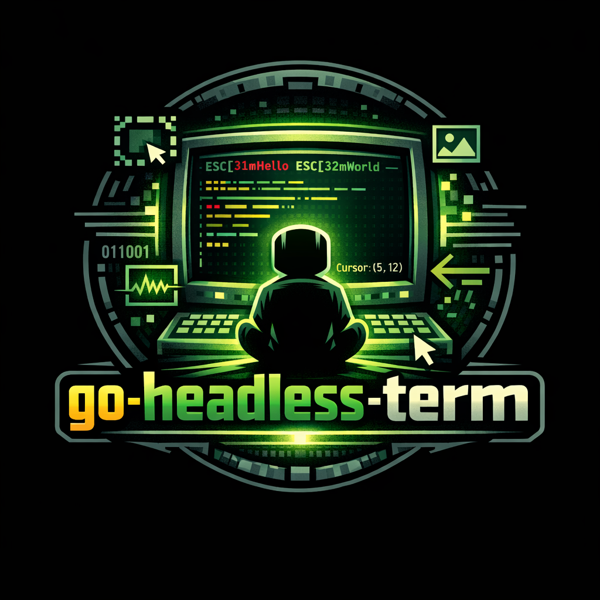

# go-headless-term

[](https://goreportcard.com/report/github.com/danielgatis/go-headless-term)
[](https://raw.githubusercontent.com/danielgatis/go-headless-term/master/LICENSE)
[](https://godoc.org/github.com/danielgatis/go-headless-term)



A VT220-compatible terminal emulator for Go that processes ANSI escape sequences and maintains terminal state without a display. You feed it bytes, it updates internal buffers, cursor position, colors, and modes. Useful for parsing terminal output, testing ANSI applications, or building terminal UIs.

## When should I use this?

- **Parsing terminal output**: Process ANSI-colored output from commands and extract text/formatting
- **ANSI testing**: Verify that applications produce correct escape sequences
- **Terminal UI backends**: Build headless terminal interfaces that can be rendered later
- **Log analysis**: Parse ANSI-formatted logs while preserving structure and colors
- **Output capture**: Record complete terminal state including scrollback for replay

## When should I NOT use this?

- **Interactive terminals**: This is not a PTY. It doesn't handle input, process management, or shell interaction
- **Real terminal emulators**: No rendering, no window management, no user interaction
- **Simple text extraction**: If you just need plain text, use `strings` or regex instead
- **Live terminal sessions**: This processes static byte streams, not bidirectional communication
- **Full VT100+ compatibility**: Focuses on VT220 subset; some edge cases may differ

## Mental model

The library processes a **stream of bytes** incrementally:

```
Raw bytes → ANSI decoder → Handler methods → State updates
```

**State model:**
- **Two buffers**: Primary (with scrollback) and alternate (no scrollback, for full-screen apps)
- **Active buffer**: Switches automatically when entering/exiting alternate screen mode
- **Cell grid**: 2D array where each cell stores character, colors, and formatting flags
- **Cursor**: Tracks position, visibility, and style
- **Cell template**: Default attributes (colors, bold, etc.) applied to new characters
- **Modes**: Bitmask of terminal behaviors (line wrap, insert mode, origin mode, etc.)

**Flow:**
1. You call `Write()` or `WriteString()` with raw bytes
2. Internal decoder parses ANSI sequences and calls handler methods (e.g., `Input()`, `Goto()`, `SetTerminalCharAttribute()`)
3. Handlers update buffers, cursor, colors, or modes
4. You read state via `Cell()`, `CursorPos()`, `String()`

**Thread safety**: All public methods are safe for concurrent use (internal locking).

**Providers**: Optional callbacks for external events (bell, title changes, clipboard, etc.). Default to no-ops.

## Installation

```bash
go get github.com/danielgatis/go-headless-term
```

## Minimal example

```go
package main

import (
	"fmt"
	headlessterm "github.com/danielgatis/go-headless-term"
)

func main() {
	term := headlessterm.New()

	// Write ANSI sequences
	term.WriteString("\x1b[31mHello ")  // Red text
	term.WriteString("\x1b[32mWorld")  // Green text
	term.WriteString("\x1b[0m!\r\n")   // Reset and newline

	// Read terminal content
	fmt.Println(term.String())

	// Get cursor position
	row, col := term.CursorPos()
	fmt.Printf("Cursor: row=%d, col=%d\n", row, col)
}
```

## Examples

The repository includes working examples in the `examples/` directory:

### Basic usage (`examples/basic/`)

Demonstrates basic terminal operations: writing ANSI sequences, reading content, and checking cursor position.

```bash
cd examples/basic
go run main.go
```

Shows:
- Setting terminal title (OSC 0)
- Text colors and formatting (SGR codes)
- Screen clearing
- Reading terminal state

## Core concepts / API overview

### Terminal

The main type. Created with `New()` and configured via options:

```go
term := headlessterm.New(
    headlessterm.WithSize(24, 80),
    headlessterm.WithAutoResize(),
    headlessterm.WithScrollback(storage),
)
```

**Key methods:**
- `Write([]byte)` / `WriteString(string)`: Process raw bytes (implements `io.Writer`)
- `Cell(row, col)`: Get cell at position (returns `*Cell` or `nil`)
- `CursorPos()`: Get cursor position (0-based)
- `String()`: Get visible screen content as text
- `Resize(rows, cols)`: Change dimensions
- `IsAlternateScreen()`: Check if alternate buffer is active

### Buffer

Stores the 2D cell grid. Two buffers exist:
- **Primary**: Has scrollback (lines scrolled off top are saved)
- **Alternate**: No scrollback (cleared when switching back)

Access via `Terminal.Cell()` (reads from active buffer).

### Cell

Represents one grid position:
- `Char`: The rune (character)
- `Fg` / `Bg`: Foreground/background colors (`color.Color`)
- `Flags`: Bitmask (bold, underline, reverse, etc.)
- `Hyperlink`: Optional OSC 8 hyperlink
- `IsWide()`: True if character occupies 2 columns (CJK, emoji)
- `IsWideSpacer()`: True if this is the second cell of a wide character

### Options

Configure terminal at creation:
- `WithSize(rows, cols)`: Set dimensions (default: 24x80)
- `WithAutoResize()`: Buffer grows instead of scrolling/wrapping
- `WithScrollback(provider)`: Custom scrollback storage
- `WithResponse(writer)`: Writer for terminal responses (DSR, etc.)
- `WithBell(provider)`: Handler for bell events
- `WithTitle(provider)`: Handler for title changes
- `WithClipboard(provider)`: Handler for OSC 52 clipboard
- `WithNotification(provider)`: Handler for OSC 99 desktop notifications (Kitty protocol)
- `WithMiddleware(mw)`: Intercept handler calls

### Providers

Interfaces for external events (all optional, default to no-ops):
- `BellProvider`: Called on BEL (0x07)
- `TitleProvider`: Called on OSC 0/1/2 (title changes)
- `ClipboardProvider`: Called on OSC 52 (clipboard read/write)
- `ScrollbackProvider`: Stores lines scrolled off top
- `RecordingProvider`: Captures raw input bytes
- `NotificationProvider`: Called on OSC 99 (desktop notifications, Kitty protocol)

### Dirty tracking

Cells track modification state:
- `HasDirty()`: True if any cell modified since last `ClearDirty()`
- `DirtyCells()`: List of modified positions
- `ClearDirty()`: Reset tracking

Useful for incremental rendering (only redraw changed cells).

### Desktop Notifications (OSC 99)

The terminal supports the Kitty desktop notification protocol (OSC 99). Implement `NotificationProvider` to handle notifications:

```go
type MyNotificationHandler struct{}

func (h *MyNotificationHandler) Notify(payload *headlessterm.NotificationPayload) string {
    // Handle the notification
    fmt.Printf("Notification: %s\n", string(payload.Data))

    // For query requests, return capabilities
    if payload.PayloadType == "?" {
        return "\x1b]99;i=test;p=title:body\x1b\\"
    }
    return ""
}

term := headlessterm.New(
    headlessterm.WithNotification(&MyNotificationHandler{}),
)
```

The `NotificationPayload` contains:
- `ID`: Unique identifier for chunking/tracking
- `PayloadType`: Type of data ("title", "body", "icon", "?", etc.)
- `Data`: Payload content (decoded if base64)
- `Urgency`: 0 (low), 1 (normal), 2 (critical)
- `Sound`: Notification sound ("system", "silent", etc.)
- `Actions`: Click behavior ("focus", "report")
- And more fields for icons, timeouts, app name, etc.

See [Kitty Desktop Notifications](https://sw.kovidgoyal.net/kitty/desktop-notifications/) for protocol details.

## Buy me a coffee

Liked some of my work? Buy me a coffee (or more likely a beer)

<a href="https://www.buymeacoffee.com/danielgatis" target="_blank"></a>

## License

Copyright (c) 2020-present [Daniel Gatis](https://github.com/danielgatis)

Licensed under [MIT License](./LICENSE.txt)
